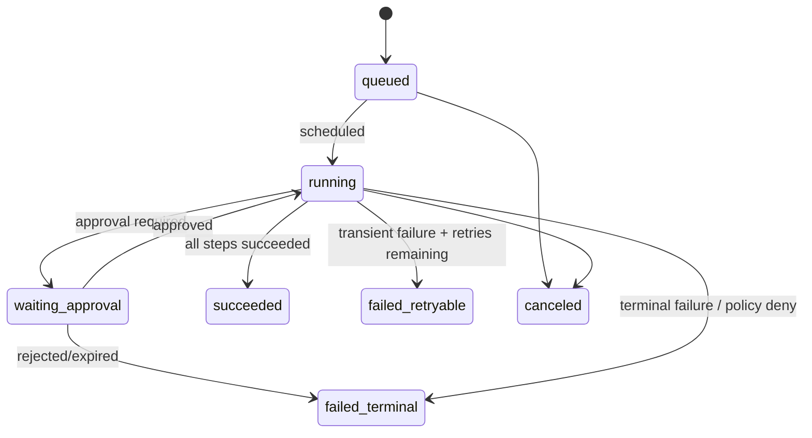
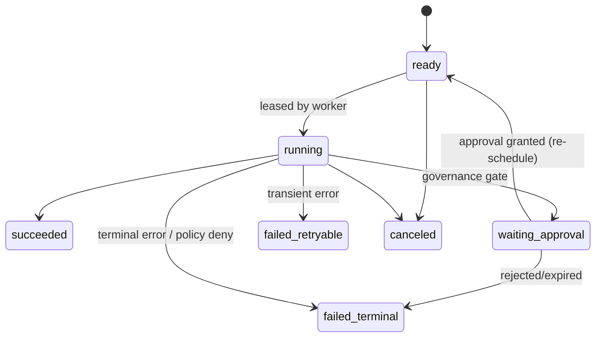

# Runtime queue + worker state machine (MVP)

This document defines the **execution semantics** for the MVP runtime:
- at-least-once step execution (safe via idempotency keys + receipts)
- reversible writes allowed (assignment/labels/internal notes), gated by policy and caps
- HITL approval (Slack) as a first-class pause/resume point
- fail-closed policy evaluation on every side-effecting action

## 1) Runtime objects

### 1.1 Run
A **Run** is an instance of a workflow version executing against a trigger event (e.g. ServiceNow webhook).

Key fields:
- `run_id`, `tenant_id`, `workspace_id`, `workflow_version_id`
- `trigger_type`, `trigger_ref` (used for dedupe/idempotency)
- `status` (see §2)

### 1.2 Step
A **Step** is a single executable unit within a run.

Key fields:
- `step_id` (stable string from YAML), `step_index`
- `tool_name` (connector call, transform, model call)
- `idempotency_key` (**required**) – stable for the step + external target
- `lease_owner`, `lease_expires_at` for distributed execution

### 1.3 Approval
An **Approval** is created when policy requires human authorization for a proposed action (typically *writes*).

Key fields:
- `tier` (low/med/high) + optional `"two_person"` gate (MVP policy flag)
- `status`: requested/approved/rejected/expired/canceled

### 1.4 Action Receipt
Every external side effect emits an **Action Receipt** capturing:
- what was attempted (request_metadata)
- what happened (response_metadata)
- whether it’s reversible + how to reverse

Receipts are the source of truth for evidence bundles and safe retries.

## 2) State machine

### 2.1 Run status

### 2.2 Step status

**Invariant:** a run is `succeeded` iff every step is `succeeded`.

## 3) Queueing + leasing model

### 3.1 At-least-once execution
We assume **at-least-once delivery** from the queue system and crashes at any point.

Therefore:
- Steps must be **idempotent**
- The worker must be prepared to see the **same message** again

### 3.2 Lease acquisition
A worker can execute a step only after it acquires a lease:

1. `UPDATE steps SET lease_owner=?, lease_expires_at=now()+TTL
   WHERE step_pk=? AND status='ready'
   AND (lease_expires_at is null OR lease_expires_at < now())
   RETURNING *;`
2. If no row returned → another worker owns it, or it is not ready.

The worker must heartbeat/extend the lease if execution is long-running.

### 3.3 Visibility timeout vs DB lease
If using SQS (or similar), treat queue visibility timeout as **advisory** and DB lease as **authoritative**. The queue can re-deliver; the DB lease prevents double execution.

### 3.4 Concurrency caps and fairness
MVP constraints:
- tenant-level caps: `max_concurrency`, `max_runs_per_min`, `max_writes_per_run`
- workflow-level caps: optional overrides

Implementation approach:
- runtime scheduler reads runnable steps and enqueues them while respecting caps.
- fairness: round-robin by tenant/workspace or weighted by purchased capacity units.

## 4) Idempotency model (required)

### 4.1 Idempotency keys
`idempotency_key` must uniquely identify the side effect.

Examples:
- ServiceNow incident update:
  `sn:incident:update:{instance}:{incident_sys_id}:{fields_hash}`
- Slack message post:
  `slack:post:{channel}:{thread_ts}:{body_hash}`

The system enforces uniqueness (`unique (tenant_id, idempotency_key)`).

### 4.2 Receipts as dedupe source
Before performing an external action:
1. Look up existing receipt by `(tenant_id, run_id, step_id)` **or** `idempotency_key`.
2. If found and status is success → return cached result and mark step succeeded.

## 5) Governance checkpoints (fail-closed)

For every side-effecting tool call:

1. Construct a **proposed action** (connector, operation, target, fields, risk tier)
2. Evaluate policy:
   - if **deny** → step = `failed_terminal`, run follows
   - if **allow** → proceed
   - if **needs_approval** → create approval, step = `waiting_approval`

Approvals are surfaced via Slack; the approval decision is appended to audit.

## 6) Retry policy

### 6.1 Retryable vs terminal
Retryable examples:
- network timeouts, 5xx, rate limits
Terminal examples:
- 4xx with invalid payload
- policy denies
- approval rejected/expired

### 6.2 Backoff
Use exponential backoff with jitter (e.g. 5s → 30s → 2m → 10m) capped by SLA.

Store:
- `attempt`
- `last_error`
- `next_eligible_at` (optional; can be derived) or use queue delay.

## 7) HITL integration (Slack)

Flow:
1. Step enters `waiting_approval`
2. Orchestrator posts an approval card to Slack with:
   - summary, proposed writes, policy rationale
   - “Approve” / “Reject” actions
3. Slack action callback triggers approval resolution
4. Approval resolution appends audit entry and re-schedules step (back to `ready`)

## 8) Evidence bundle outputs (per run)

At run completion, generate an evidence bundle containing:
- inputs (metadata-only), outputs (metadata-only)
- policy decisions + approvals
- action receipts
- cost rollups (per provider/model)
- audit hash chain checkpoints

Bundle is stored as an artifact (e.g. S3 object) with a sha256 recorded in DB.
